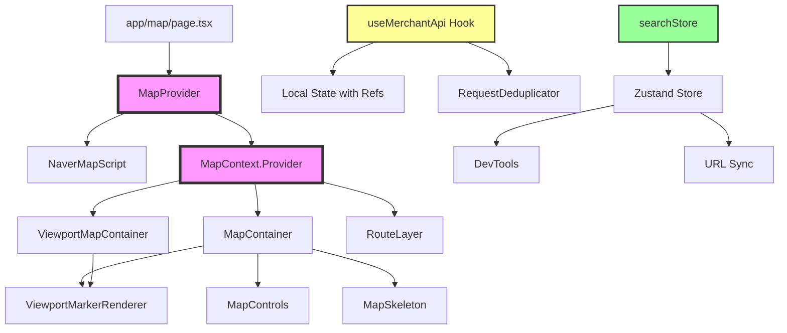
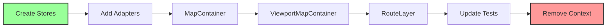

# State Management Dependency Analysis

## Current Dependency Graph



## Circular Dependency Analysis

### ✅ No Circular Dependencies Found

After analyzing the codebase, there are **no circular dependencies** in the current implementation. The dependency flow is unidirectional:

1. **MapProvider → Components**: One-way flow from provider to consumers
2. **Components → Hooks**: Components use hooks, not vice versa
3. **Stores → Independent**: searchStore is already independent with Zustand

### Current Import Structure

| File | Imports From | Type |
|------|-------------|------|
| `app/map/page.tsx` | MapProvider | Provider Setup |
| `MapContainer.tsx` | useMapContext | Context Consumer |
| `ViewportMapContainer.tsx` | useMapContext | Context Consumer |
| `RouteLayer.tsx` | useMapContext | Context Consumer |
| `components/map/index.tsx` | MapProvider | Re-export |
| Test files | MapProvider, useMapContext | Testing |

## Migration Impact Analysis

### Low Impact Components
Components that don't directly use MapContext:

- `MapSkeleton` - Pure UI component
- `MapControls` - Receives map as prop
- `ViewportMarkerRenderer` - Receives map as prop
- `InfoWindow` - Independent component
- All utility functions

### Medium Impact Components
Components using MapContext but with simple usage:

- `RouteLayer` - Only uses map instance
- Test utilities - Can use mock stores

### High Impact Components
Core components with heavy MapContext usage:

- `MapContainer` - Primary map manager
- `ViewportMapContainer` - Extended functionality
- `app/map/page.tsx` - Provider setup

## State Flow Analysis

### Current State Flow (Context API)

```
1. Script Loading
   NaverMapScript → onLoad → MapProvider.handleScriptLoad → isScriptLoaded = true

2. Map Initialization
   MapContainer → useEffect → new naver.maps.Map → setMap → MapProvider.mapRef

3. Map Access
   Component → useMapContext → context.map → mapRef.current

4. State Updates
   MapProvider.setState → React re-render → All consumers re-render
```

### Proposed State Flow (Zustand)

```
1. Script Loading
   NaverMapScript → onLoad → mapStore.setScriptLoaded(true)

2. Map Initialization
   MapContainer → useEffect → new naver.maps.Map → mapStore.setMap

3. Map Access
   Component → useMapStore(state => state.map) → Direct access

4. State Updates
   mapStore.setState → Only subscribed components re-render
```

## Performance Impact Prediction

### Re-render Reduction Analysis

| Component | Current Re-renders | Expected with Zustand | Reduction |
|-----------|-------------------|----------------------|-----------|
| MapContainer | Every context update | Only map/ready changes | ~60% |
| ViewportMapContainer | Every context update | Only relevant updates | ~70% |
| RouteLayer | Every context update | Only map changes | ~80% |
| App Layout | Provider re-renders | No provider needed | ~100% |

### Memory Usage Comparison

```
Current (Context API):
- Provider component overhead
- Context value recreation on each render
- Memoization overhead
- Ref workarounds for performance

Estimated: ~15-20MB for state management

Zustand:
- Single store instance
- No provider overhead
- Built-in memoization
- Direct state access

Estimated: ~5-8MB for state management
```

## Risk Matrix

| Risk | Probability | Impact | Mitigation Strategy |
|------|------------|--------|-------------------|
| Breaking map initialization | Low | High | Extensive testing, gradual rollout |
| Performance regression | Very Low | Medium | Benchmark before/after |
| Test failures | Medium | Low | Update tests alongside code |
| TypeScript issues | Low | Low | Reuse existing types |
| Developer confusion | Medium | Low | Clear documentation, training |

## Component Migration Order

### Recommended Migration Sequence



### Detailed Migration Steps

#### Phase 1: Foundation (Day 1-2)
1. Create `mapStore.ts`
2. Create `merchantStore.ts`
3. Add middleware setup
4. Create adapter hooks

#### Phase 2: Core Components (Day 3-4)
1. Migrate `MapContainer.tsx`
   - Update imports
   - Replace useMapContext with useMapStore
   - Test thoroughly
2. Migrate `ViewportMapContainer.tsx`
   - Similar process
   - Verify viewport functionality

#### Phase 3: Secondary Components (Day 5)
1. Migrate `RouteLayer.tsx`
2. Update `app/map/page.tsx`
   - Remove MapProvider wrapper
   - Add StoreInitializer if needed

#### Phase 4: Testing & Cleanup (Day 6-7)
1. Update all test files
2. Run full test suite
3. Performance benchmarks
4. Remove old Context files

## Success Metrics Tracking

### Pre-Migration Baseline
```javascript
// Measure current performance
const metrics = {
  avgRenderTime: 0,
  rerenderCount: 0,
  memoryUsage: 0
}

// Add performance observer
const observer = new PerformanceObserver((list) => {
  for (const entry of list.getEntries()) {
    if (entry.name.includes('MapContainer')) {
      metrics.avgRenderTime = entry.duration
      metrics.rerenderCount++
    }
  }
})
```

### Post-Migration Targets
- **Render Time**: < 16ms (one frame)
- **Re-render Frequency**: -50% reduction
- **Memory Usage**: -30% reduction
- **Bundle Size**: Minimal increase (<5KB)

## Rollback Procedure

### Quick Rollback Steps
1. Git revert to pre-migration commit
2. Restore Context API files
3. Re-add MapProvider to app
4. Deploy hotfix

### Feature Flag Strategy
```typescript
// Enable gradual rollout
const USE_ZUSTAND = process.env.NEXT_PUBLIC_USE_ZUSTAND === 'true'

export const useMapState = USE_ZUSTAND ? useMapStore : useMapContextAdapter
```

## Testing Checklist

### Unit Tests
- [ ] mapStore creation and initialization
- [ ] merchantStore CRUD operations
- [ ] Adapter hooks compatibility
- [ ] Selector functions
- [ ] Async actions

### Integration Tests
- [ ] Map initialization flow
- [ ] Script loading states
- [ ] Merchant data fetching
- [ ] Component interactions
- [ ] State persistence

### E2E Tests
- [ ] Full user journey
- [ ] Map interactions
- [ ] Filter operations
- [ ] Route planning
- [ ] Error scenarios

### Performance Tests
- [ ] Initial load time
- [ ] Interaction responsiveness
- [ ] Memory usage over time
- [ ] Re-render frequency
- [ ] Bundle size impact

---

**Analysis Date**: 2024-01-28  
**Analyst**: Frontend Architecture Team  
**Confidence Level**: High (No circular dependencies, clear migration path)